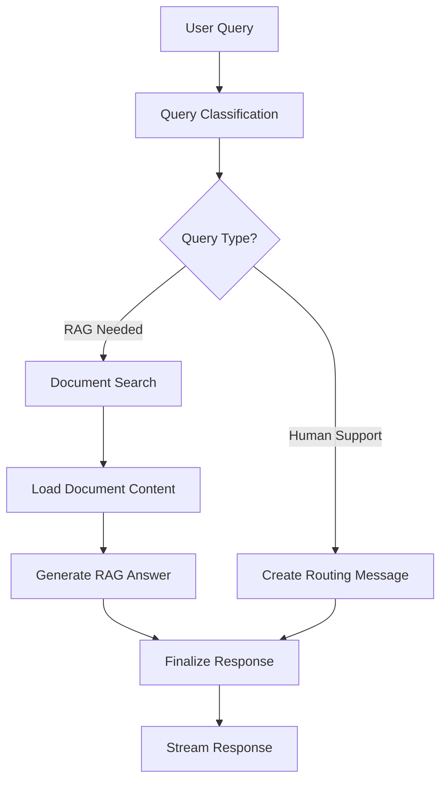

# Nora - Atlan Support Chatbot
Inspiration from [Prukalpa Mam’s LinkedIn post](https://www.linkedin.com/posts/prukalpa_updates-activity-7357581444539445250-9pxI/) about first AI Employee at Atlan.

Hence, I named my Agent AI and used the same photo from the post screenshot :).

<div align="center">
  
  
  **AI-powered customer support chatbot for Atlan**
  
  **Built with LangGraph + Prompt Versioning/Observability/Evals with LangSmith**
    
  [](https://python.org)
  [](https://fastapi.tiangolo.com)
  [](https://nextjs.org)
  [](https://langchain-ai.github.io/langgraph)
</div>

## 🚀 Overview

Nora is an intelligent customer support chatbot specifically designed for Atlan, an active metadata platform. It leverages advanced AI technologies to provide accurate, contextual, and helpful responses to user queries about Atlan's features, integrations, and best practices.

### Key Capabilities

- **🧠 Intelligent Query Classification**: Automatically categorizes queries by topic, sentiment, and priority
- **🔍 RAG-Powered Responses**: Uses Retrieval-Augmented Generation with Pinecone vector database
- **🎯 Smart Routing**: Routes complex queries to appropriate support teams
- **📚 Documentation Search**: Semantic search across Atlan's entire knowledge base
- **💬 Real-time Chat**: Streaming responses with Server-Sent Events (SSE)
- **🎨 Modern UI**: Beautiful, responsive interface built with Next.js 15 and Tailwind CSS

## 🏗️ Architecture

Nora follows a modern microservices architecture with clear separation of concerns:

```
┌─────────────────┐    ┌─────────────────┐    ┌─────────────────┐
│   Frontend      │    │   Backend       │    │   External      │
│   (Next.js 15)  │◄──►│   (FastAPI)     │◄──►│   Services      │
│                 │    │                 │    │                 │
│ • React 19      │    │ • LangGraph     │    │ • Google AI     │
│ • TypeScript    │    │ • Pydantic      │    │ • Pinecone      │
│ • Tailwind CSS  │    │ • Uvicorn       │    │ • Atlan Docs    │
└─────────────────┘    └─────────────────┘    └─────────────────┘
```

### LangGraph Agent Pipeline

The core intelligence is powered by a sophisticated LangGraph workflow:



## 📁 Project Structure

```
Nora/
│
├── backend/                          # FastAPI Backend
│   ├── app/
│   │   ├── api/                      # API Routes
│   │   │   └── routes/
│   │   │       ├── chat.py           # Chat endpoints with SSE
│   │   │       └── bulk.py           # Bulk classification
│   │   │
│   │   ├── core/                     # Core Configuration
│   │   │   ├── config.py             # Settings & environment
│   │   │   └── langgraph/            # LangGraph Components
│   │   │       ├── agent.py          # Main Nora agent
│   │   │       ├── classifier.py     # Query classifier
│   │   │       ├── tools/            # Agent tools
│   │   │       │   └── document_search_tool.py
│   │   │       └── prompts/          # Prompt management
│   │   │           ├── manager.py
│   │   │           └── templates.py
│   │   │
│   │   ├── dependencies/             # Dependency Injection
│   │   │   ├── agent.py              # Agent dependency
│   │   │   └── classifier.py         # Classifier dependency
│   │   │
│   │   ├── models/                   # Pydantic Models
│   │   │   ├── chat.py               # Chat-related models
│   │   │   └── search.py             # Search-related models
│   │   │
│   │   └── main.py                   # FastAPI app initialization
│   │
│   ├── pyproject.toml                # Python dependencies (uv)
│   └── uv.lock                       # Lock file
│
├── frontend/                         # Next.js 15 Frontend App Router based app
└── README.md                         # This file
```

## ✨ Features

### 🧠 Intelligent Query Processing
- **Multi-dimensional Classification**: Categorizes queries by topic (How-to, Product, Connector, etc.), sentiment (Frustrated, Curious, Neutral, etc.), and priority (P0, P1, P2)
- **Smart Routing**: Automatically determines whether to use RAG or route to human support
- **Context Awareness**: Maintains conversation context across multiple interactions

### 🔍 Advanced Document Search
- **Semantic Search**: Uses Pinecone vector database for intelligent document retrieval
- **Real-time Indexing**: Searches across Atlan's entire knowledge base
- **Relevant Results**: Returns the most contextually relevant documentation chunks

### 💬 Enhanced Chat Experience
- **Streaming Responses**: Real-time response streaming using Server-Sent Events
- **Dual View**: Shows both internal analysis and final user response
- **Session Management**: Maintains conversation history and context
- **Error Handling**: Graceful error handling with user-friendly messages

### 🎨 Modern User Interface
- **Responsive Design**: Works seamlessly across desktop and mobile devices
- **Dark/Light Mode**: Built-in theme switching with system preference detection
- **Component Library**: Built with Shadcn/ui and Radix UI primitives
- **Accessibility**: WCAG compliant with proper ARIA labels and keyboard navigation

### 🔧 Developer Experience
- **Type Safety**: Full TypeScript support across frontend and backend
- **Hot Reload**: Fast development with instant feedback
- **API Documentation**: Auto-generated OpenAPI/Swagger documentation
- **Modular Architecture**: Clean separation of concerns and dependency injection

## 🚀 Quick Start

### Prerequisites

- **Python 3.11+** with [uv](https://docs.astral.sh/uv/) package manager
- **Node.js 18+** with [pnpm](https://pnpm.io/) package manager
- **Google AI API Key** for Gemini models
- **Pinecone API Key** for vector search

### 1. Clone and Setup

```bash
git clone <repository-url>
cd Nora
```

### 2. Backend Setup

```bash
cd backend

# Install dependencies using uv
uv sync

# Create environment file
cp .env.example .env
# Edit .env with your API keys:
# GOOGLE_API_KEY=your_google_api_key
# PINECONE_API_KEY=your_pinecone_api_key
# PINECONE_INDEX_NAME=atlan-docs-free

# Run the backend server
uv run python -m uvicorn app.main:app --reload --host 0.0.0.0 --port 8000
```

The backend will be available at `http://localhost:8000`

### 3. Frontend Setup

```bash
cd frontend

# Install dependencies
pnpm install

# Run the development server
pnpm run dev
```

The frontend will be available at `http://localhost:3000`

### 4. Verify Installation

1. Open `http://localhost:3000` in your browser
2. You should see the Nora chat interface
3. Try asking a question like "How do I connect Snowflake to Atlan?"
4. Check the backend logs for processing details

## 🔧 Configuration

### Environment Variables

Create a `.env` file in the `backend/` directory:

```env
# Required API Keys
GOOGLE_API_KEY=your_google_api_key_here
PINECONE_API_KEY=your_pinecone_api_key_here

# Optional Configuration
PINECONE_INDEX_NAME=atlan-docs-free
DEFAULT_MODEL=gemini-1.5-flash
EMBEDDING_MODEL=all-MiniLM-L6-v2
DEBUG=false
HOST=0.0.0.0
PORT=8000


# LangSmith (Optional)
LANGCHAIN_TRACING_V2=false
LANGCHAIN_API_KEY=your_langsmith_api_key
LANGCHAIN_ENDPOINT=https://api.smith.langchain.com
LANGCHAIN_PROJECT=nora-chatbot
```

### API Endpoints

| Endpoint | Method | Description |
|----------|--------|-------------|
| `/chat` | POST | Main chat endpoint with SSE streaming |
| `/bulk` | POST | Bulk query classification |
| `/docs` | GET | Interactive API documentation |

## 🛠️ Development

### Backend Development

```bash
cd backend

# Install development dependencies
uv sync --dev

# Run with hot reload
uv run python -m uvicorn app.main:app --reload --host 0.0.0.0 --port 8000

# Run tests
uv run pytest

# Format code
uv run black app/
uv run isort app/
```

### Frontend Development

```bash
cd frontend

# Install dependencies
pnpm install

# Run development server
pnpm run dev

# Build for production
pnpm run build

# Run linting
pnpm run lint

# Type checking
pnpm run type-check
```

## 📊 API Usage Examples

### Chat with Streaming Response

```bash
curl -X POST "http://localhost:8000/chat" \
  -H "Content-Type: application/json" \
  -d '{
    "query": "How do I set up SSO with Azure AD in Atlan?",
    "session_id": "user-session-123"
  }'
```

### Bulk Classification

```bash
curl -X POST "http://localhost:8000/bulk" \
  -H "Content-Type: application/json" \
  -d '{
    "queries": [
      "How do I connect Snowflake?",
      "I am having issues with data lineage",
      "Can you help me set up a glossary?"
    ]
  }'
```
---

<div align="center">
  <p>Built with ❤️ for the Atlan Intern Challenge</p>
  <p>
    <a href="#nora---atlan-support-chatbot">⬆️ Back to Top</a>
  </p>
</div>
